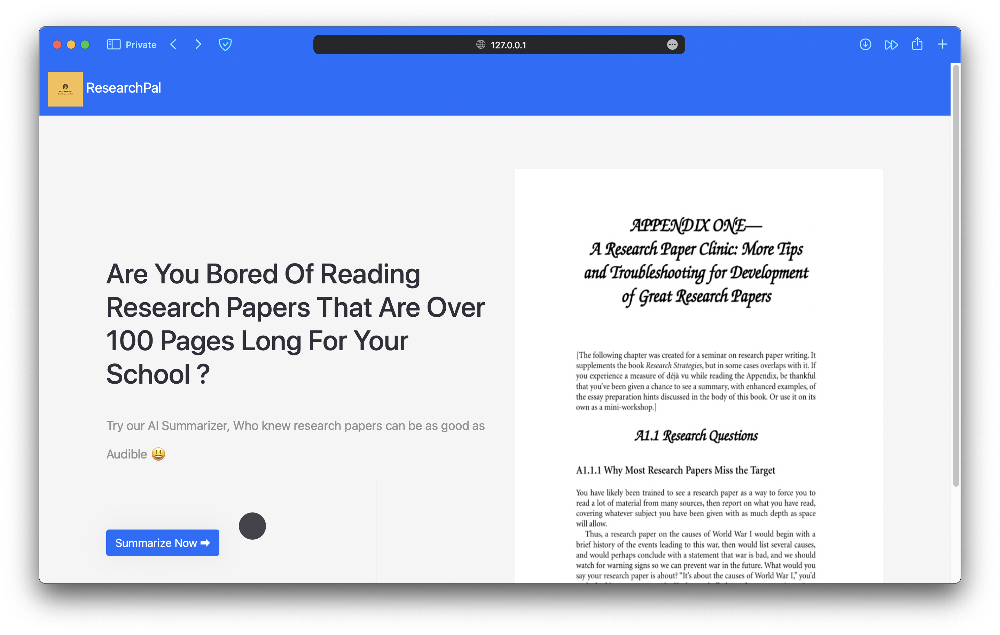
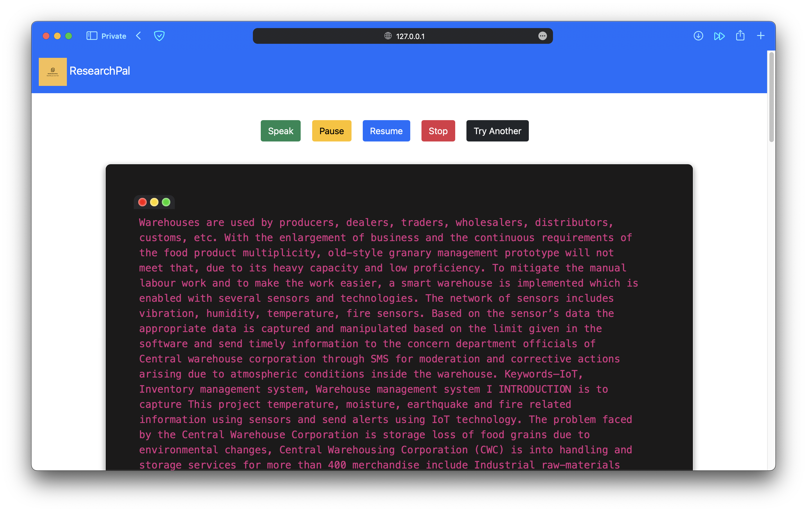
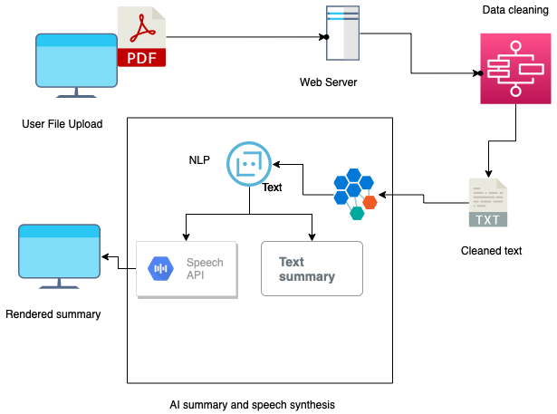

<h1 align="center">
	
</h1>

<h3 align="center"><i>
	ResearchPal - Your AI Summarizer for wonderful Research papers , Who knew research papers can be as good as Audible ?</i>
</h3>

<p align="center">
	<strong>
		<a href="https://youtu.be/s827jXwK2OA">Demo</a>
	</strong>
</p>
<p align="center">
	
</p>
<p align="center">
	
</p>

## Overview

- **Find your favourite research paper.** Grab them as a PDF file we'll handle the rest.
- **Clean summary.** Get the most out of your research paper with us 
- **Speech Synthesis.** Vola! not just summary you can listen to them as well 
- **Be the pilot.** You can play,Pause,Resume where you left off.

<p align="center">
	
</p>

### Setup

The following commands install and run the development version of ResearchPal:

```sh
git clone https://github.com/kabilanvennila/BitLords_SRMHackathon.git
cd researchpal
pip install -r requirements.txt
python manage.py migrate
python manage.py runserver
```
You can check it live at your `127.0.0.1:8000`
